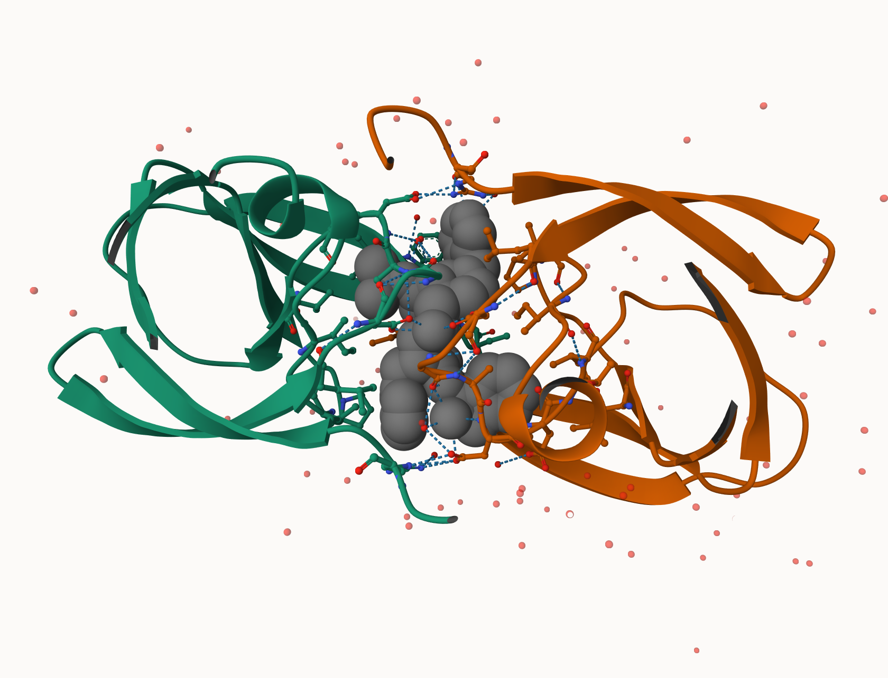

##Protein Data Bank

```{r}
pdb <- read.csv("pdb_stats.csv")
```

> Q1: What percentage of structures in the PDB are solved by X-Ray and Electron Microscopy.

X-Ray: 177449 EM: 21115 93.7% of PDB structure are sloved by X-Ray or Electron Microscopy

> Q2: What proportion of structures in the PDB are protein?

234549/239521=0.98 98% of structures in the PDB are protein or protein complexes

> Q3: Type HIV in the PDB website search box on the home page and determine how many HIV-1 protease structures are in the current PDB?

There are on the order of \~100+ HIV-1 protease structures in the current PDB.

```{r}
figure1 <- 

figure1
```

> Q4: Water molecules normally have 3 atoms. Why do we see just one atom per water molecule in this structure?

Because X-ray crystallography usually cannot resolve hydrogen atoms.

```{r}
figure2 <- knitr::include_graphics("1HSG (1).png")

figure2
```

> Q5: There is a critical “conserved” water molecule in the binding site. Can you identify this water molecule? What residue number does this water molecule have

HOH308 2 flap residues

> Q6: Generate and save a figure clearly showing the two distinct chains of HIV-protease along with the ligand. You might also consider showing the catalytic residues ASP 25 in each chain and the critical water (we recommend “Ball & Stick” for these side-chains). Add this figure to your Quarto document.

```{r}
figure2
```

> Discussion Topic: Can you think of a way in which indinavir, or even larger ligands and substrates, could enter the binding site?

Indinavir and even larger ligands or substrates enter the HIV-1 protease binding site through transient opening of the flexible β-hairpin flaps that cover the active site. Although crystal structures typically capture the protease in a closed conformation, in solution these flaps undergo dynamic “breathing” motions that temporarily open a pathway into the active site, allowing ligand entry before the flaps close again and are stabilized by interactions with the bound ligand and a conserved water molecule.

> Q7: \[Optional\] As you have hopefully observed HIV protease is a homodimer (i.e. it is composed of two identical chains). With the aid of the graphic display can you identify secondary structure elements that are likely to only form in the dimer rather than the monomer?

HIV-1 protease is a homodimer, and several secondary-structure elements only form in the dimeric state rather than in isolated monomers. These include the complete catalytic active site, which requires contributions from Asp25 and Asp25′ from each monomer, an interfacial β-sheet formed by N- and C-terminal residues from both chains that stabilizes the dimer, and the well-defined closed flap conformation, which is stabilized by interactions between the two monomers and is unlikely to be structurally stable in a monomer alone.

##Introduction to Bio3D in R

```{r}
library(bio3d)
pdb <- read.pdb("1HSG.pdb")
pdb
```

> Q7: How many amino acid residues are there in this pdb object?

198

> Q8: Name one of the two non-protein residues?

HOH(127), MK1(1)

> Q9: How many protein chains are in this structure?

2

Note that the attributes (+ attr:) of this object are listed on the last couple of lines. To find the attributes of any such object you can use:

```{r}
attributes(pdb)
```

To access these individual attributes we use the dollar-attribute name convention that is common with R list objects. For example, to access the atom attribute or component use pdb\$atom:

```{r}
head(pdb$atom)
```

##Quick PDB visualization in R

```{r}
library(bio3dview)
library(NGLVieweR)

```

You can also customize the display in many ways with minimal code. For example, lets custom color the chains and highlight some key residues as spacefill/vdw:

```{r}
# Select the important ASP 25 residue
sele <- atom.select(pdb, resno=25)

# and highlight them in spacefill representation
```

## Predicting functional motions of a single structure

Read a new PDB structure of Adenylate Kinase and perform Normal mode analysis.

```{r}
adk <- read.pdb("6s36")
```

Normal mode analysis (NMA) is a structural bioinformatics method to predict protein flexibility and potential functional motions (a.k.a. conformational changes).

```{r}
# Perform flexiblity prediction
m <- nma(adk)

```


To view a “movie” of these predicted motions we can generate a molecular “trajectory” with the mktrj() function.


##Comparative structure analysis of Adenylate Kinase

In this section, we need to perform principal component analysis (PCA) on the complete collection of Adenylate kinase structures in the protein data-bank (PDB).

```
install.packages("bio3d")
install.packages("NGLVieweR")

install.packages("remotes")
remotes::install_github("bioboot/bio3dview")

install.packages("BiocManager")
BiocManager::install("msa")

```

>Q10. Which of the packages above is found only on BioConductor and not CRAN? 

msa

>Q11. Which of the above packages is not found on BioConductor or CRAN?: 

bio3dview

>Q12. True or False? Functions from the pak package can be used to install packages from GitHub and BitBucket?

TRUE

Below we perform a blast search of the PDB database to identify related structures to our query Adenylate kinase (ADK) sequence. In this particular example we use function `get.seq()` to fetch the query sequence for chain A of the PDB ID 1AKE and use this as input to `blast.pdb()`. Note that `get.seq()` would also allow the corresponding UniProt identifier.

```{r}
library(bio3d)
aa <- get.seq("1ake_A")
aa
```


>Q13. How many amino acids are in this sequence, i.e. how long is this sequence?

214 position columns

Now we use the following vector of PDB IDs

```{r}
hits <- NULL
hits$pdb.id <- c('1AKE_A','6S36_A','6RZE_A','3HPR_A','1E4V_A','5EJE_A','1E4Y_A','3X2S_A','6HAP_A','6HAM_A','4K46_A','3GMT_A','4PZL_A')
```


The Blast search and subsequent filtering identified a total of 13 related PDB structures to our query sequence. The PDB identifiers of this collection are accessible through the `$pdb.id` attribute to the hits object (i.e. `hits$pdb.id`). Note that adjusting the cutoff argument (to `plot.blast()`) will result in a decrease or increase of hits.

We can now use function `get.pdb()` and `pdbslit()` to fetch and parse the identified structures.

# Download releated PDB files
```{r}
# Download releated PDB files
files <- get.pdb(hits$pdb.id, path="pdbs", split=TRUE, gzip=TRUE)
```

Next we will use the pdbaln() function to align and also optionally fit (i.e. superpose) the identified PDB structures.

```{r}
# Align releated PDBs
pdbs <- pdbaln(files, fit = TRUE, exefile="msa")
```

The function pdb.annotate() provides a convenient way of annotating the PDB files we have collected. Below we use the function to annotate each structure to its source species. This will come in handy when annotating plots later on:

```{r}
# Vector containing PDB database codes
ids <- basename.pdb(pdbs$id)

anno <- pdb.annotate(ids)
unique(anno$source)
```

PCA


```{r}
# Perform PCA
pc.xray <- pca(pdbs)
plot(pc.xray)
```

```{r}
# Calculate RMSD
rd <- rmsd(pdbs)

# Structure-based clustering
hc.rd <- hclust(dist(rd))
grps.rd <- cutree(hc.rd, k=3)

plot(pc.xray, 1:2, col="grey50", bg=grps.rd, pch=21, cex=1)
```


