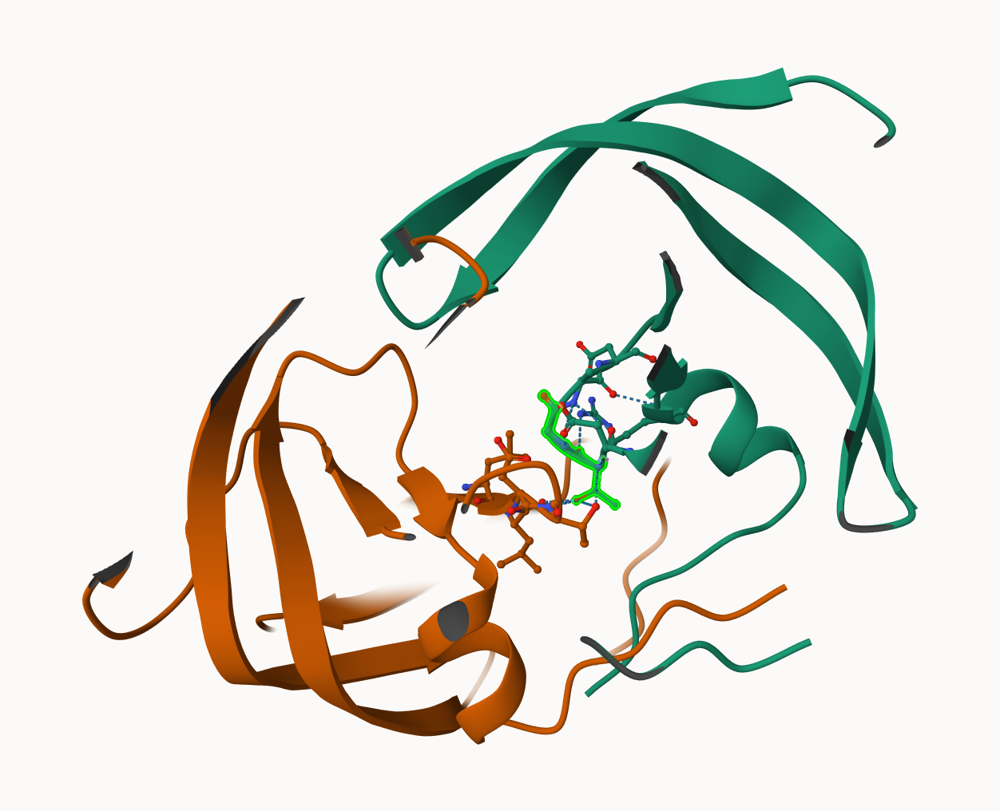

##Querying the AlphaFold database

Search the sequence in AlphaFold database

My top hits: Gag-Pol polyprotein
AF-0000000365763110-v1

## Interpreting Results

```{r}
img <- png::readPNG("AF-A0A6L8LSL6-F1-MODEL_V6.PDB-AF-0000000365763110-MODEL_V1.PDB.png")

plot(0:1, 0:1, type = "n", xlab = "", ylab = "", axes = FALSE)
rasterImage(img, 0, 0, 1, 1)

```

Insert the AlhaFlod results into R

```{r}
library(bio3d)
results_dir <- "HIVprdimer_23119" 
pdb_files <- list.files(path=results_dir,
                        pattern="*.pdb",
                        full.names = TRUE)

# File names for all PDB models
pdb_files <- list.files(path=results_dir,
                        pattern="*.pdb",
                        full.names = TRUE)

# Print our PDB file names
basename(pdb_files)

# Read all data from Models 
#  and superpose/fit coords
pdbs <- pdbaln(pdb_files, fit=TRUE, exefile="msa")

```

```{r}
pdbs
```


RMSD is a standard measure of structural distance between coordinate sets. We can use the rmsd() function to calculate the RMSD between all pairs models.

```{r}
rd <- rmsd(pdbs, fit=T)
range(rd)
library(pheatmap)

colnames(rd) <- paste0("m",1:5)
rownames(rd) <- paste0("m",1:5)
pheatmap(rd)
```

Now lets plot the pLDDT values across all models. Recall that this information is in the B-factor column of each model and that this is stored in our aligned `pdbs` object as `pdbs$b` with a row per structure/model.


```{r}
# Read a reference PDB structure
pdb <- read.pdb("1hsg")

plotb3(pdbs$b[1,], typ="l", lwd=2, sse=pdb)
points(pdbs$b[2,], typ="l", col="red")
points(pdbs$b[3,], typ="l", col="blue")
points(pdbs$b[4,], typ="l", col="darkgreen")
points(pdbs$b[5,], typ="l", col="orange")
abline(v=100, col="gray")
```

We can improve the superposition/fitting of our models by finding the most consistent “rigid core” common across all the models. For this we will use the `core.find()` function:

```{r}
core <- core.find(pdbs)
core.inds <- print(core, vol=0.5)
xyz <- pdbfit(pdbs, core.inds, outpath="corefit_structures")
```

Now we can examine the RMSF between positions of the structure. RMSF is an often used measure of conformational variance along the structure:

```{r}
rf <- rmsf(xyz)

plotb3(rf, sse=pdb)
abline(v=100, col="gray", ylab="RMSF")
```

##Predicted Alignment Error for domain

Independent of the 3D structure, AlphaFold produces an output called **Predicted Aligned Error (PAE)**. This is detailed in the JSON format result files, one for each model structure.

```{r}
library(jsonlite)

# Listing of all PAE JSON files
pae_files <- list.files(path=results_dir,
                        pattern=".*model.*\\.json",
                        full.names = TRUE)

pae1 <- read_json(pae_files[1],simplifyVector = TRUE)
pae5 <- read_json(pae_files[5],simplifyVector = TRUE)
pae2 <- read_json(pae_files[2],simplifyVector = TRUE)

attributes(pae1)

# Per-residue pLDDT scores 
#  same as B-factor of PDB..
head(pae1$plddt) 


```

The maximum PAE values are useful for ranking models. The lower the PAE score the better.

> Q. How about the other models, what are thir max PAE scores?

```{r}
pae1$max_pae
pae5$max_pae

pae2$max_pae
```

We can plot the N by N (where N is the number of residues) PAE scores with ggplot or with functions from the Bio3D package:

```{r}
plot.dmat(pae5$pae, 
          xlab="Residue Position (i)",
          ylab="Residue Position (j)",
          grid.col = "black",
          zlim=c(0,30))
```

We should really plot all of these using the same z range. Here is the model 1 plot again but this time using the same data range as the plot for model 5:

```{r}
plot.dmat(pae1$pae, 
          xlab="Residue Position (i)",
          ylab="Residue Position (j)",
          grid.col = "black",
          zlim=c(0,30))

```

##Residue conservation from alignment file

Use code to analyze residue conservation from a multiple sequence alignment

```{r}
aln_file <- list.files(path=results_dir,
                       pattern=".a3m$",
                        full.names = TRUE)
aln_file

aln <- read.fasta(aln_file[1], to.upper = TRUE)

dim(aln$ali)

sim <- conserv(aln)
```

Use code tp plot the conservation scores for the first 99 residues and overlays them with secondary structure information from chain A of a PDB structure.

```{r}
plotb3(sim[1:99], sse=trim.pdb(pdb, chain="A"),
       ylab="Conservation Score")
```
Note the conserved Active Site residues D25, T26, G27, A28. These positions will stand out if we generate a consensus sequence with a high cutoff value:

```{r}
con <- consensus(aln, cutoff = 0.9)
con$seq
```
For a final visualization of these functionally important sites we can map this conservation score to the Occupancy column of a PDB file for viewing in molecular viewer programs such as Mol*, PyMol, VMD, chimera etc.

```{r}
m1.pdb <- read.pdb(pdb_files[1])
occ <- vec2resno(c(sim[1:99], sim[1:99]), m1.pdb$atom$resno)
write.pdb(m1.pdb, o=occ, file="m1_conserv.pdb")
```

```{r}


```

