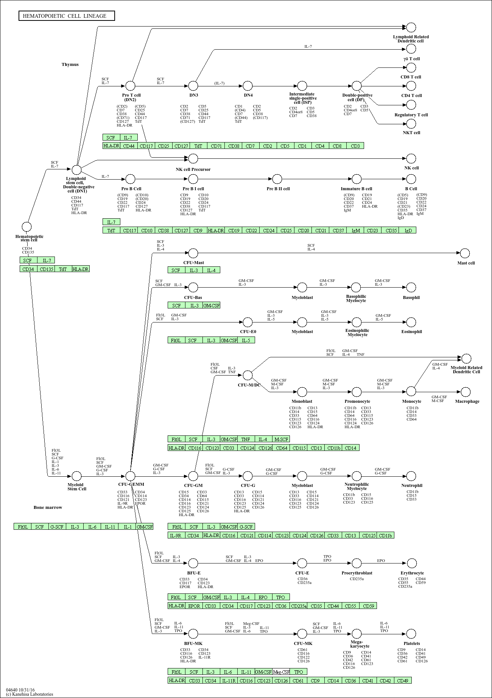
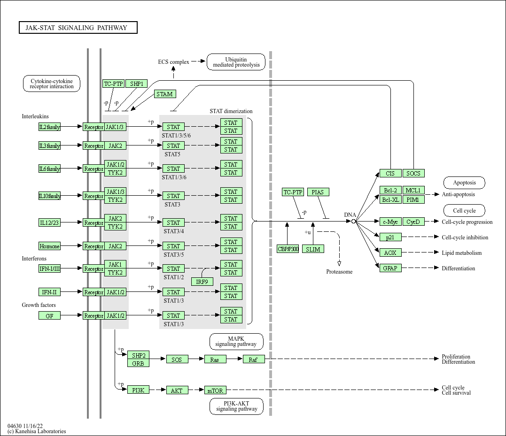

## Import Data

```{r}
library(BiocManager)
library(gage)
library(DESeq2)
```


```{r}

metaFile <- "GSE37704_metadata.csv"
countFile <- "GSE37704_featurecounts.csv"

colData <- read.csv(metaFile, row.names=1)
countData <- read.csv(countFile, row.names=1)

head(colData)
head(countData)
```
>Q1. Complete the code below to remove the troublesome first column from countData

```{r}
# Note we need to remove the odd first $length col
countData <- as.matrix(countData[,-1])
head(countData)
```

This looks better but there are lots of zero entries in there so let's get rid of them as we have no data for these.

>Q2. Complete the code below to filter countData to exclude genes (i.e. rows) where we have 0 read count across all samples (i.e. columns).

```{r}
# Filter count data where you have 0 read count across all samples.
countData = countData[rowSums(countData) > 0, ]
head(countData)
```

##Running DESeq2

Setup the DESeqDataSet object required for the DESeq() function and then run the DESeq pipeline. This is again similar to our last day's hands-on session.

```{r}
dds = DESeqDataSetFromMatrix(countData = countData,
                             colData = colData,
                             design = ~ condition)

dds = DESeq(dds)
dds
```

Next, get results for the HoxA1 knockdown versus control siRNA.

```{r}
res = results(dds)
```

>Q3. Call the summary() function on your results to get a sense of how many genes are up or down-regulated at the default 0.1 p-value cutoff.

```{r}
summary(res)
```
#Volcano Plot

```{r}
library(ggplot2)

res_df <- as.data.frame(res)

ggplot(res_df) +
  aes(x = log2FoldChange,
      y = -log10(padj)) +
  geom_point()
```

> Q4. Improve this plot 

```{r}
# Make a color vector for all genes
mycols <- rep("gray", nrow(res))

# Color blue the genes with fold change above 2
mycols[ abs(res$log2FoldChange) > 2 ] <- "blue"

# Color gray those with adjusted p-value more than 0.01
mycols[ res$padj > 0.01 ] <- "gray"

ggplot(as.data.frame(res)) +
  aes(x = log2FoldChange,
      y = -log10(padj)) +
  geom_point(color = mycols) +
  xlab("Log2(FoldChange)") +
  ylab("-Log(P-value)") +
  geom_vline(xintercept = c(-2, 2)) +
  geom_hline(yintercept = -log10(0.01))
```
#Adding Gene Annotation

>Q5. Use the mapIDs() function multiple times to add SYMBOL, ENTREZID and GENENAME annotation to our results.

```{r}
library("AnnotationDbi")
library("org.Hs.eg.db")

columns(org.Hs.eg.db)

res$symbol = mapIds(org.Hs.eg.db,
                    keys = row.names(res), 
                    keytype = "ENSEMBL",
                    column = "SYMBOL",
                    multiVals = "first")

res$entrez = mapIds(org.Hs.eg.db,
                    keys = row.names(res),
                    keytype = "ENSEMBL",
                    column = "ENTREZID",
                    multiVals = "first")

res$name = mapIds(org.Hs.eg.db,
                  keys = row.names(res),
                  keytype = "ENSEMBL",
                  column = "GENENAME",
                  multiVals = "first")

head(res, 10)

```

>Q6. Finally for this section let's reorder these results by adjusted p-value and save them to a CSV file in your current project directory.

```{r}
# Order by adjusted p-value
res = res[order(res$padj), ]

# Write results to CSV
write.csv(res, file = "deseq_results_14.csv")
```

##Pathway Analysis
Here we are going to use the gage package for pathway analysis. 

#KEGG pathways

First we need to do our one time install of these required bioconductor packages

Now we can load the packages and setup the KEGG data-sets we need.

```{r}
library(pathview)
library(gage)
library(gageData)

data(kegg.sets.hs)
data(sigmet.idx.hs)

# Focus on signaling and metabolic pathways only
kegg.sets.hs = kegg.sets.hs[sigmet.idx.hs]

# Examine the first 3 pathways
head(kegg.sets.hs, 3)
```

The main gage() function requires a named vector of fold changes, where the names of the values are the Entrez gene IDs.

Note that we used the `mapIDs()` function above to obtain Entrez gene IDs (stored in `res$entrez`) and we have the fold change results from DESeq2 analysis (stored in `res$log2FoldChange`).

```{r}
foldchanges = res$log2FoldChange
names(foldchanges) = res$entrez
head(foldchanges)
```
Now, let’s run the gage pathway analysis.

```{r}
keggres = gage(foldchanges, gsets=kegg.sets.hs)
```

Now lets look at the object returned from `gage()`.

```{r}
attributes(keggres)
```

It is a list with three elements, "greater", "less" and "stats".

You can also see this in your Environment panel/tab window of RStudio or use the R command str(keggres).

Like any list we can use the dollar syntax to access a named element, e.g. `head(keggres$greater)` and `head(keggres$less)`.

Lets look at the first few down (less) pathway results:

```{r}
head(keggres$less)
```
Now, let's try out the pathview() function from the pathview package to make a pathway plot with our RNA-Seq expression results shown in color.
To begin with lets manually supply a pathway.id (namely the first part of the "hsa04110 Cell cycle") that we could see from the print out above.

```{r}
pathview(gene.data=foldchanges, pathway.id="hsa04110")
```

Now, let's process our results a bit more to automagicaly pull out the top 5 upregulated pathways, then further process that just to get the pathway IDs needed by the pathview() function. We'll use these KEGG pathway IDs for pathview plotting below.

```{r}
## Focus on top 5 upregulated pathways here for demo purposes only
keggrespathways <- rownames(keggres$greater)[1:5]

# Extract the 8 character long IDs part of each string
keggresids = substr(keggrespathways, start=1, stop=8)
keggresids
```

Finally, lets pass these IDs in `keggresids` to the pathview() function to draw plots for all the top 5 pathways.

```{r}
pathview(gene.data=foldchanges, pathway.id=keggresids, species="hsa")
```

```{r}

```

```{r}

```

>Q7. Can you do the same procedure as above to plot the pathview figures for the top 5 down-regulated pathways?

```{r}
# Get top 5 downregulated pathways
keggrespathways_down <- rownames(keggres$less)[1:5]

keggrespathways_down

# Extract KEGG IDs
keggresids_down <- substr(keggrespathways_down, start=1, stop=8)

keggresids_down

```
```{r}
pathview(gene.data = foldchanges,
         pathway.id = keggresids_down,
         species = "hsa")
```

##Gene Ontology

We can also do a similar procedure with gene ontology. Similar to above, go.sets.hs has all GO terms. go.subs.hs is a named list containing indexes for the BP, CC, and MF ontologies. Let’s focus on BP (a.k.a Biological Process) here.

```{r}
data(go.sets.hs)
data(go.subs.hs)

# Focus on Biological Process subset of GO
gobpsets = go.sets.hs[go.subs.hs$BP]

gobpres = gage(foldchanges, gsets=gobpsets)

lapply(gobpres, head)
```
##Reactome Analysis

Let's now conduct over-representation enrichment analysis and pathway-topology analysis with Reactome using the previous list of significant genes generated from our differential expression results above.

First, using R, output the list of significant genes at the 0.05 level as a plain text file:

```{r}
sig_genes <- res[res$padj <= 0.05 & !is.na(res$padj), "symbol"]
print(paste("Total number of significant genes:", length(sig_genes)))
```

```{r}
write.table(sig_genes, file="significant_genes.txt", row.names=FALSE, col.names=FALSE, quote=FALSE)
```

>Q8. What pathway has the most significant “Entities p-value”? Do the most significant pathways listed match your previous KEGG results? What factors could cause differences between the two methods?

The Cell Cycle, Mitotic pathway has the most significant "Entities p-value". This is consist with KEGG result which highlighting Cell cycle, DNA replication, and Homologous recombination. Both analyses indicate strong enrichment of genes involved in cell proliferation and genome replication.

However the result from the second highest p-value in reactome analysis is the Signal Transduction, different from the KEGG result.

This can be due to differences in database curation, pathway definitions, gene annotations, background gene sets, and statistical methods used by KEGG and Reactome.


